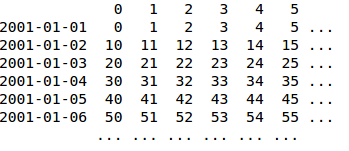
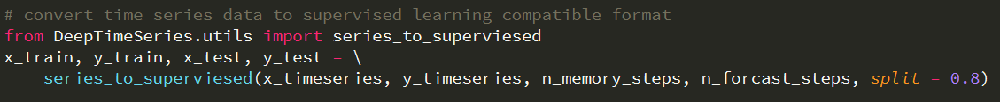
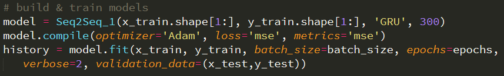
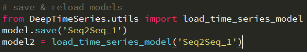
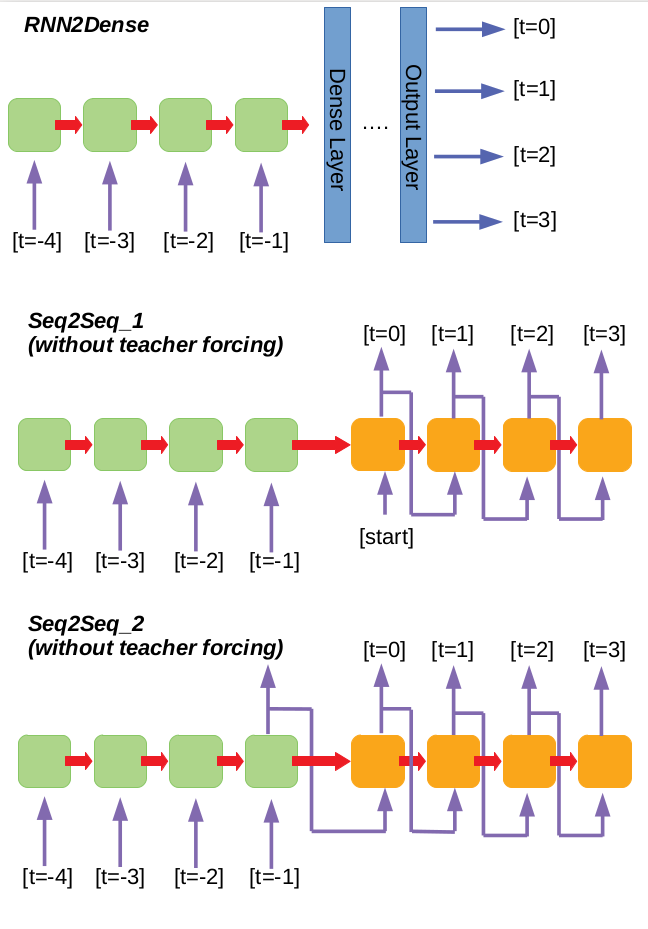

  

# Welcome to the Deep Time Series Project
**Deep Time Series** is a library to help you quickly build complicated time-series 
deep learning models such as RNN2Dense, Seq2Seq, Attention-Based, etc. This library 
is based on **Python** and the famous deep learning package **Keras**. All the APIs 
are made to as close to Keras as possible. Therefore, if you are familar with Keras, 
you should be able to hands-on in seconds. 

**Note:** Time Series data can be various. Any series data that can be vectorized 
can be considered as inputs to this library. Therefore, multi-variables time series 
data, time-dependent images, speeches, text translation, etc., should be all compatible 
to this library. 

# Usage
## Prepare Your Data in Time-Series Format
**Deep Time Series** has built-in functions that helps you convert your standard 
time series dataframe to supervised learning format. For example, we have the following
time series dataframe in Pandas:

  

Usually, you should have two such dataframe. One is for the input data the other is the
target data (we're doing supervised learning, right?). Then you can simply convert them 
to format that are good for supervised learning by calling the function:

  

, where the **n_memory_step** is the number of previous time steps you want to use for 
each time step and **n_forcast_step** is the number of future time steps you want to 
forcast. **split = 0.8** will split the first 80% time steps as train set and the rest
20% time steps as test set.    
    

## Build and Train Your Models

In **Deep Time Series**, all models are wrapped into a single objects. To build a model, 
e.g. sequence-to-sequence model, you can just type:

  

As you may immedately notice that the commands here are almost identical to Keras. Yes, 
this is the purpose of this library, i.e. a time-series model-based library that
helps you build complicated time-series models in just a few lines. 

## Save and Reload model 

Once your model is trained, you can save and reload the model for future inference. Also,
the syntaxs are almost identical to Keras:

  

 

[**A complete example can be found here**](https://github.com/pipidog/DeepTimeSeries/blob/master/Example/PowerAnalysis.py)   

# Supported Models

Currently **Deep Time Series** supports three major frameworks as shown below. Each 
framework supports **simple RNN, LSTM, GRU** as their RNN cell. Therefore there are 
9 popular models. Other models such as **teacher-forcing Seq2Seq** and **Attention-based** 
will be included soon.  

  

